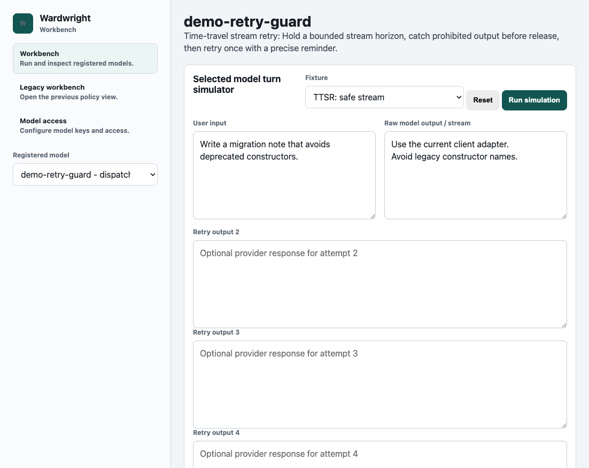

# Wardwright

Wardwright is a governed model gateway for AI agents.

Agents call Wardwright using normal OpenAI-compatible model names. Wardwright
decides what those names mean: which provider or local model to use, what policy
rules apply, when to retry, reroute, block, or rewrite output, and what receipt
should be recorded afterward.

Use Wardwright when you want model behavior to be a reviewed, testable contract
instead of scattered prompt strings, provider IDs, and retry logic inside every
agent.

Wardwright models can be simple, such as one local Ollama target, or more
structured, such as a route graph that delegates to other Wardwright models,
switches providers by context size, applies stream rules, and records why each
decision happened.

Today, Wardwright can run as a local or remote service, expose
OpenAI-compatible endpoints, define Wardwright models, simulate policy behavior
in the `/admin` workbench, record receipts, and exercise early policy examples
such as routing decisions, stream governance, output checks, retries, and saved
simulator test cases. The legacy `/policies` workbench is still present during
the transition, but new operator workflows start from `/admin`. The admin
surface currently supports basic auth, while individual models can be configured
for API-key or open access.

## Install

Wardwright publishes early native binaries for macOS and Linux. The latest
published release is `v0.0.10`, with a model-aware workbench, saved simulator
test cases, a legacy experimental in-page authoring assistant, and local
ratchets for style and browser-regression checks.

### macOS Homebrew

```bash
brew tap bglusman/tap
brew install wardwright
wardwright admin
```

For one-shot foreground testing instead of a service:

```bash
WARDWRIGHT_SECRET_KEY_BASE="$(cat "$(brew --prefix)/etc/wardwright/secret_key_base")" \
WARDWRIGHT_BIND=127.0.0.1:8787 \
wardwright serve
```

### Linux Tarball

```bash
curl -fsSL https://raw.githubusercontent.com/bglusman/wardwright/main/scripts/install.sh | sh
WARDWRIGHT_SECRET_KEY_BASE="$(openssl rand -base64 64)" \
WARDWRIGHT_BIND=127.0.0.1:8787 \
~/.local/bin/wardwright serve
```

For a pinned release:

```bash
curl -fsSL https://raw.githubusercontent.com/bglusman/wardwright/main/scripts/install.sh | sh -s -- --version v0.0.10
```

Set `WARDWRIGHT_ADMIN_TOKEN` before exposing Wardwright beyond loopback. See
[Packaging](docs/packaging.md) for release targets, manual archive install
steps, and service details.

Then visit `http://127.0.0.1:8787/admin`. Set `BASIC_AUTH_PASSWORD` before
exposing the workbench or protected control APIs beyond loopback; the Basic Auth
username is always `admin`. Model calls remain governed separately by Model
Management.

## Model Management

Wardwright models are unkeyed by default. Operators can set a model to require a
model-scoped API key, or set unkeyed models to internal-only composition:

```json
{
  "requires_api_key": true,
  "auth": { "unkeyed_model_access": "public" }
}
```

Use the protected `/admin` operator UI to select a registered model and generate
or revoke keys for that model. Raw keys are shown once; Wardwright
stores only a hash in the SQLite store at
`~/.local/share/wardwright/wardwright.sqlite3` unless `XDG_DATA_HOME` or
`WARDWRIGHT_SQLITE_STORE` points somewhere else. The same store persists
registered model definitions. Model Management can archive a model so it no
longer appears in discovery or routing, restore it from the SQLite registry, or
hard-delete the archived artifact when it should stop being recoverable.
Keep `WARDWRIGHT_SECRET_KEY_BASE` stable, or set
`WARDWRIGHT_MODEL_API_KEY_HASH_SECRET` explicitly, so stored keys remain
verifiable across restarts. To encrypt the SQLite store, provide
`WARDWRIGHT_SQLITE_KEY` or `WARDWRIGHT_SQLITE_KEY_FNOX`; the exqlite NIF must be
built against SQLCipher or Wardwright will fail closed at startup.

Receipts are stored separately as one JSON file per receipt under
`~/.local/share/wardwright/receipts`, unless `WARDWRIGHT_RECEIPT_STORE_DIR`
points somewhere else. Test builds can disable receipt persistence and keep
receipts in memory.

## Use With Agents

The installed binary includes discovery commands for local agents and
operators:

```bash
wardwright --help
wardwright serve
wardwright admin
wardwright tools
wardwright tools --json
```

Wardwright exposes:

- OpenAI-compatible `/v1/chat/completions` and `/v1/models` endpoints.
- A registered-model workbench at `/admin`.
- Protected authoring APIs, plus MCP tools at `/mcp`.
- Receipts, simulations, model access details, and admin status endpoints.

See [Agent Authoring](docs/agent-authoring.md) for the review loop external
agents should follow before activating a model.

`wardwright admin` opens the workbench in your browser. If nothing is listening
on the configured `WARDWRIGHT_BIND` port, it starts a local background service
first. Use `wardwright admin access` to jump directly to Model Management.

## Provider Credentials

Local Ollama targets need no credential. OpenAI-compatible targets can reference
credentials with either `credential_fnox_key` or `credential_env`.
`credential_fnox_key` is the preferred local-operator path, but Wardwright does
not install fnox for you; the runtime expects `fnox get KEY` to work on the host.

Fnox keeps raw provider keys out of artifacts and logs, but it is not a
Wardwright authentication system. Keep real provider credentials on
loopback-only instances or behind a trusted auth boundary. Do not configure real
provider credentials on an instance reachable by untrusted users. See
[Provider Credentials](docs/provider-credentials.md).

## Policy Workbench

The installed service includes a registered-model workbench at `/admin`. It
lets you choose the Wardwright model being simulated, load a fixture, edit caller
input, backend model output, and retry attempts, then step through routing,
state transitions, stream retries, rewrites, tool decisions, and receipt events.
The older `/policies` workbench remains in the service during the transition,
but new operator workflows should start from `/admin`.



See [Policy Workbench](docs/workbench.md) for screenshots and workflow details.
See [Model Middleware](docs/wardwright-models.md) for the current model
composition shape.

## Current Runtime

The active app is a Phoenix service with a Lustre operator workbench. Elixir
owns Phoenix, HTTP/API boundaries, provider calls, storage drivers, PubSub, and
top-level supervision; Gleam owns correctness-heavy policy logic and new
workbench behavior. Runtime state is being evaluated for `gleam_otp` migration
where typed actors can remove invalid states or clarify concurrency ownership.

Current capabilities include:

- Wardwright model routing with provider targets and route-DAG delegation.
- Request, route, stream, output, history, alert, and tool policy behavior.
- Streaming TTSR-style governance with bounded buffering, retries, rewrites,
  and receipt evidence.
- ETS-backed hot policy history plus protected authoring, simulation, receipt,
  and admin surfaces.
- Workspace recipe loading for seeded and local model examples.
- Simulation-target selection, editable simulator turns, and saved scenario/test
  case records.
- An experimental in-page authoring assistant that uses the same review-oriented
  tool registry as external agents.

Wardwright is still early. Interfaces are treated as product contracts, and
unsupported inputs should fail loudly or be documented as current limitations.

## Development

Run the active native suite:

```bash
(cd app && mise exec -- mix format --check-formatted && mise exec -- mix test)
```

Run the app locally:

```bash
(cd app && WARDWRIGHT_BIND=127.0.0.1:8791 mise exec -- mix run --no-halt)
```

Live provider smoke tests are outside the default suite. Configure at least one
target, then run:

```bash
WARDWRIGHT_LIVE_OLLAMA_MODEL=qwen2.5-coder:latest mise run test:live-providers
```

## License

Apache-2.0.
