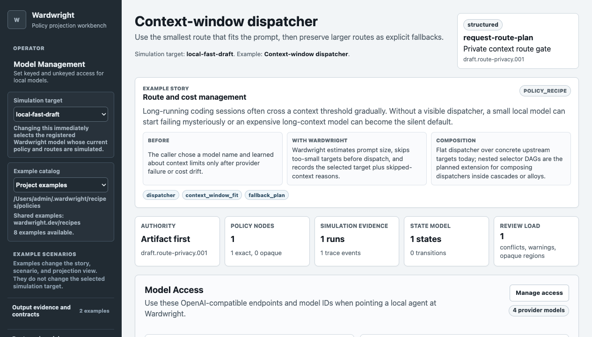

# Wardwright

Wardwright is middleware for LLM models. Agents call a stable
OpenAI-compatible model name while Wardwright owns the behavior behind it:
provider routing, model composition, policy checks, stream retries and rewrites,
tool controls, caller traceability, simulations, and receipts.

Wardwright models can be simple, such as one local Ollama target, or more
structured, such as a route graph that delegates to other Wardwright models,
switches providers by context size, applies stream rules, and records why each
decision happened.

## Install

Wardwright publishes early native binaries for macOS and Linux. The latest
prepared release is `v0.0.5`.

### macOS Homebrew

```bash
brew tap bglusman/tap
brew install wardwright
brew services start wardwright
open http://127.0.0.1:8787/policies
```

For one-shot foreground testing instead of a service:

```bash
WARDWRIGHT_SECRET_KEY_BASE="$(cat "$(brew --prefix)/etc/wardwright/secret_key_base")" \
WARDWRIGHT_BIND=127.0.0.1:8787 \
wardwright serve
```

### Linux Tarball

```bash
curl -fsSL https://raw.githubusercontent.com/bglusman/wardwright/main/scripts/install.sh | sh
WARDWRIGHT_SECRET_KEY_BASE="$(openssl rand -base64 64)" \
WARDWRIGHT_BIND=127.0.0.1:8787 \
~/.local/bin/wardwright serve
```

For a pinned release:

```bash
curl -fsSL https://raw.githubusercontent.com/bglusman/wardwright/main/scripts/install.sh | sh -s -- --version v0.0.5
```

Set `WARDWRIGHT_ADMIN_TOKEN` before exposing Wardwright beyond loopback. See
[Packaging](docs/packaging.md) for release targets, manual archive install
steps, and service details.

Then visit `http://127.0.0.1:8787/policies`. Set `BASIC_AUTH_PASSWORD` before
exposing the workbench or protected control APIs beyond loopback; the Basic Auth
username is always `admin`. Model calls remain governed separately by model
access configuration.

## Model Access

Wardwright models are unkeyed by default. Operators can set a model to require a
model-scoped API key, or set unkeyed models to internal-only composition:

```json
{
  "requires_api_key": true,
  "auth": { "unkeyed_model_access": "public" }
}
```

Use the protected `/admin/model-api-keys` page to generate or revoke keys for
the active model. Raw keys are shown once; Wardwright stores only a hash. Keep
`WARDWRIGHT_SECRET_KEY_BASE` stable, or set `WARDWRIGHT_MODEL_API_KEY_HASH_SECRET`
explicitly, so stored keys remain verifiable across restarts.

## Use With Agents

The installed binary includes discovery commands for local agents and
operators:

```bash
wardwright --help
wardwright serve
wardwright tools
wardwright tools --json
```

Wardwright exposes:

- OpenAI-compatible `/v1/chat/completions` and `/v1/models` endpoints.
- A policy workbench at `/policies`.
- Protected authoring APIs and MCP at `/mcp`.
- Receipts, simulations, model access details, and admin status endpoints.

See [Agent Authoring](docs/agent-authoring.md) for the review loop external
agents should follow before activating a model.

## Provider Credentials

Local Ollama targets need no credential. OpenAI-compatible targets can reference
credentials with either `credential_fnox_key` or `credential_env`.
`credential_fnox_key` is the preferred local-operator path, but Wardwright does
not install fnox for you; the runtime expects `fnox get KEY` to work on the host.

Fnox keeps raw provider keys out of artifacts and logs, but it is not a
Wardwright authentication system. Keep real provider credentials on
loopback-only instances or behind a trusted auth boundary. Do not configure real
provider credentials on an instance reachable by untrusted users. See
[Provider Credentials](docs/provider-credentials.md).

## Policy Workbench

The installed service includes a LiveView workbench at `/policies`. It loads
seeded and local examples, lets you edit simulated caller input, backend model
output, and relevant history, then steps through routing, state transitions,
stream retries, rewrites, tool decisions, and receipt events.



See [Policy Workbench](docs/workbench.md) for screenshots and the example
catalog. See [Model Middleware](docs/wardwright-models.md) for the current model
composition shape.

## Current Runtime

The active app is a Phoenix/LiveView service. Elixir owns runtime plumbing,
provider calls, HTTP/API boundaries, receipts, and the UI. Gleam is used for
correctness-heavy pure policy logic where the boundary is stable.

Current capabilities include:

- Wardwright model routing with provider targets and route-DAG delegation.
- Request, route, stream, output, history, alert, and tool policy behavior.
- Streaming TTSR-style governance with bounded buffering, retries, rewrites,
  and receipt evidence.
- ETS-backed hot policy history plus protected authoring, simulation, receipt,
  and admin surfaces.
- Workspace recipe loading for seeded and local model examples.

Wardwright is still early. Interfaces are treated as product contracts, and
unsupported inputs should fail loudly or be documented as current limitations.

## Development

Run the active native suite:

```bash
(cd app && mise exec -- mix format --check-formatted && mise exec -- mix test)
```

Run the app locally:

```bash
(cd app && WARDWRIGHT_BIND=127.0.0.1:8791 mise exec -- mix run --no-halt)
```

Live provider smoke tests are outside the default suite. Configure at least one
target, then run:

```bash
WARDWRIGHT_LIVE_OLLAMA_MODEL=qwen2.5-coder:latest mise run test:live-providers
```

## License

Apache-2.0.
