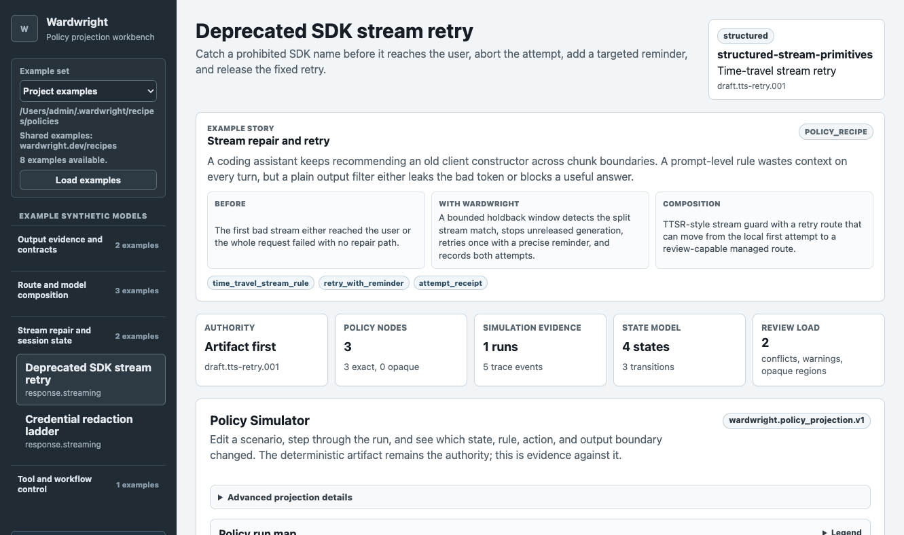
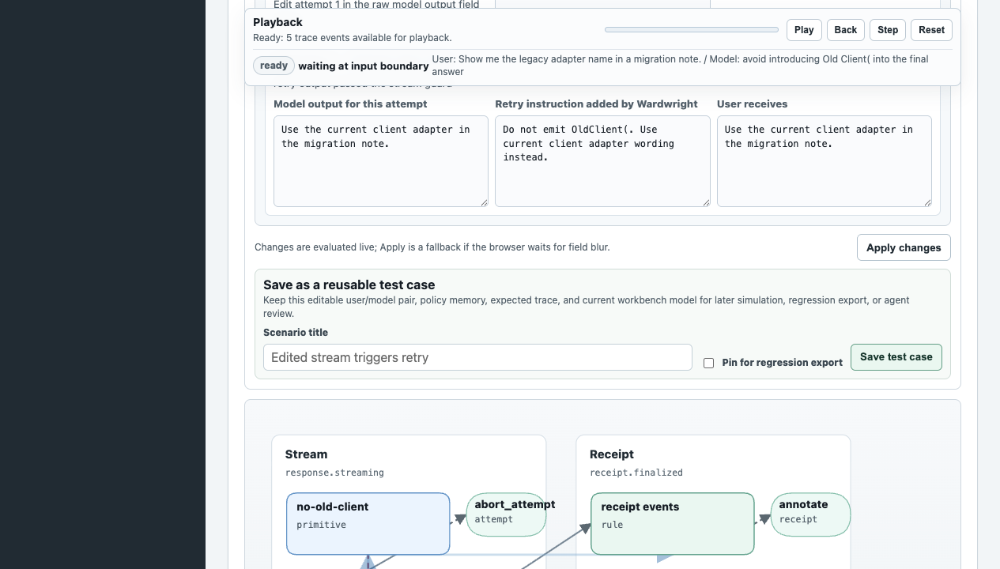
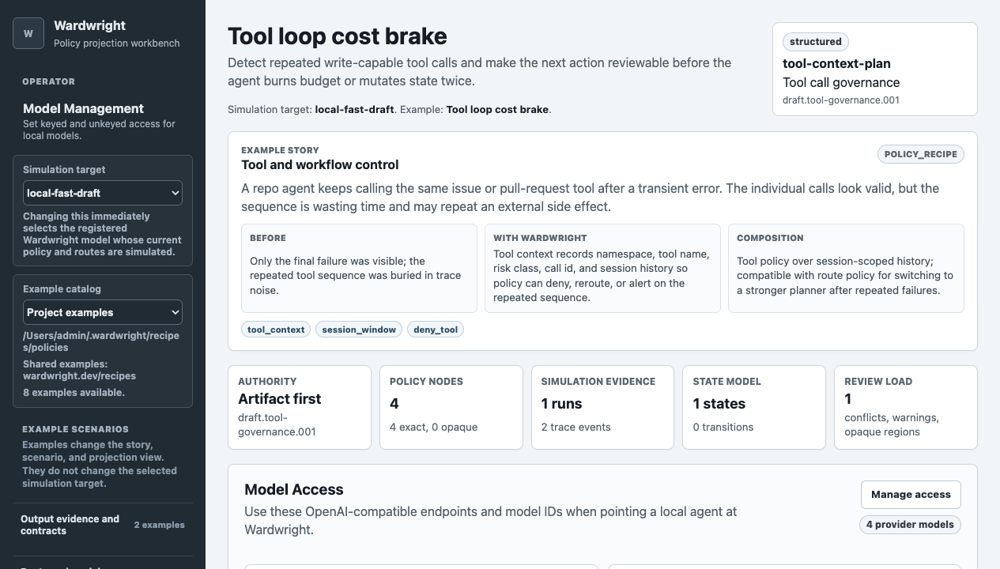

# Policy Workbench

The Wardwright package includes a Phoenix LiveView workbench at `/policies`.
It is meant for inspecting Wardwright model middleware before wiring it into
production traffic: choose the simulation target, pick an example or local model
artifact, load a scenario, edit the simulated request, model output, retry
attempts, and relevant history, then step through the resulting policy run.

Loopback access is allowed by default. If the workbench is exposed beyond local
operator access, set `BASIC_AUTH_PASSWORD`; the Basic Auth username is always
`admin`.

The protected key page at `/admin/model-api-keys` can select any registered
model, generate and revoke model-scoped API keys for it, and edit whether that
model is keyed or unkeyed. Those keys authorize model calls only when the model
artifact sets `requires_api_key` to `true`; unkeyed models remain public or
internal-only according to `auth.unkeyed_model_access`.

The deterministic model artifact remains the source of truth. The workbench is
the review surface for understanding how that artifact compiles into routes,
state changes, stream guards, retries, tool controls, output changes, and
receipts.

<figure>
  
  <figcaption>Route and model composition example: the simulator shows why the model graph chose a context-fit route and which larger routes remain available as fallbacks.</figcaption>
</figure>

## Simulator

The simulator follows one model call through Wardwright's boundaries:

1. Raw caller input and the input sent to the backend model.
2. Backend model output or stream chunks and the output released to the user.
3. Session history and policy memory used by threshold or sequence rules.
4. Route selection, state transitions, retries, rewrites, tool decisions, and
   receipt events.

The simulation-target selector controls which registered Wardwright model config
is used for projection and simulation. The examples in the left rail are
scenario lenses: they can be run against any selected simulation target, even when
the example was written to demonstrate a different policy family.

Most simple examples have identical raw and delivered input/output. When a
policy changes a request, holds stream chunks, retries a generation, rewrites an
answer, or blocks a tool call, the simulator keeps both sides visible so the
change can be reviewed.

<figure>
  
  <figcaption>Stream repair example: a held stream can trigger a retry with a targeted reminder, then release the corrected attempt instead of leaking the bad span or failing the whole request.</figcaption>
</figure>

## Saved Test Cases

Any edited turn can be saved as a reusable test case. A saved case stores the
title, expected behavior, selected simulation target, artifact hash, raw user
input, upstream model response, retry-attempt outputs, history facts used by the
policy, and the current trace/receipt preview.

<figure>
  
  <figcaption>Saved test cases keep the user/model pair and policy memory with the model under review, so later agent changes can be checked against the same evidence.</figcaption>
</figure>

Saved cases are intentionally small and reviewable. Pin a case when it should be
exported as regression evidence; leave it unpinned when it is exploratory and
safe for retention pruning.

## Example Categories

Fresh installs seed a starter workspace under
`~/.config/wardwright/recipes/policies`. The next-release example set is grouped around
the behaviors Wardwright is designed to make understandable:

- **Output evidence and contracts:** incomplete-success detection and structured
  output repair gates.
- **Route and model composition:** private-context route gates, context-window
  routing, partial-context model blends, and route-DAG delegation.
- **Stream repair and session state:** time-travel stream retry and credential
  redaction/state escalation examples.
- **Tool and workflow control:** repeated tool-call sequence detection and
  reviewable cost brakes.

<figure>
  
  <figcaption>Tool governance example: tool history can make an otherwise valid next call reviewable once the sequence becomes risky.</figcaption>
</figure>

## Local Models

The built-in examples are not special at runtime. The workbench reads policy
recipes from the configured workspace directory, grouping folders as example
collections. Locally authored Wardwright models that use a supported projection
shape are displayed, simulated, and inspected through the same UI as the seeded
examples.

Unsupported future policy shapes should fail clearly or remain hidden until the
projection contract supports them. That keeps the UI honest: a recipe catalog
entry can describe a model, but the simulator should only claim behavior it can
actually replay from deterministic policy data and simulation evidence.

## Agent-Assisted Authoring

Wardwright exposes tool discovery for external agents and is also testing an
optional in-page authoring assistant backed by the same registry. After
installing, run:

```bash
wardwright admin
wardwright tools
wardwright tools --json
```

`wardwright admin` opens the workbench and starts a local background service
first if the configured bind port is not already responding. The same registry
backs the protected policy-authoring API and the MCP endpoint mounted at
`/mcp`. Point a local agent at the Wardwright service, let it inspect the
available tools, and use the workbench to review the policy or saved test cases
it creates. See the [Agent Authoring Guide](agent-authoring.html) for the
expected inspect-simulate-draft-validate-review-activate loop.

The first useful write path is intentionally narrow:

- `draft_wardwright_model` builds and validates a Wardwright model artifact from
  supplied provider/model targets, route graph nodes, governance rules, and
  stream rules.
- `activate_wardwright_model` validates the same artifact and registers or
  updates that local OpenAI-compatible model alongside other active models.
- `propose_rule_change` returns a draft artifact with an appended, replaced, or
  removed governance or stream rule. It is draft-only and never applies changes.
- `record_scenario` and `delete_scenario` let agents maintain small reviewed
  simulator cases over the protected HTTP API; scenario MCP write tools remain a
  follow-up until the review/auth boundary is settled.

After activation, agents can call `/v1/chat/completions` with either the flat
model id such as `support-router` or the prefixed id
`wardwright/support-router`.
