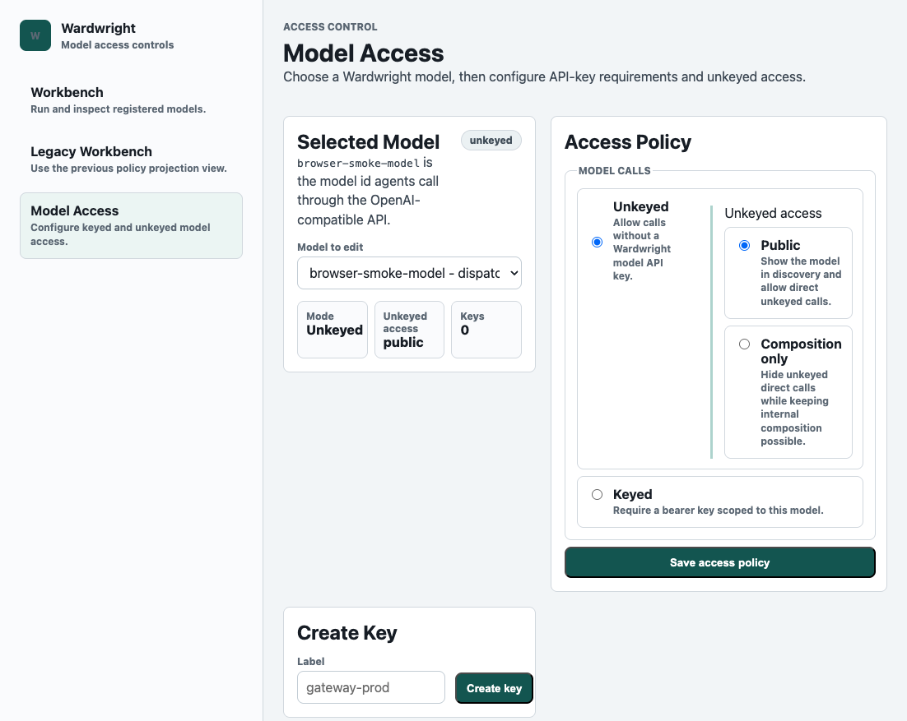

# Workbench

The primary Wardwright workbench lives at `/admin`. It is the operator
surface for choosing a registered Wardwright model, loading a simulation
fixture, editing caller input, backend model output, retry attempts, and then
stepping through the resulting policy run.

The workbench includes an example model library for toy routing, composition,
retry, and rewrite policies. Old `/policies` links now redirect to `/admin` so
there is only one operator workbench surface.

Loopback access is allowed by default. If the workbench is exposed beyond local
operator access, set `BASIC_AUTH_PASSWORD`; the Basic Auth username is always
`admin`.

The Models & access view is part of the same protected `/admin` shell. It can
select any registered model, generate and revoke model-scoped API keys for it,
edit whether that model is keyed or unkeyed, and choose the model-scoped replay
capture mode. Those keys authorize model calls only when the model artifact
sets `requires_api_key` to `true`; unkeyed models remain public or
composition-only according to `auth.unkeyed_model_access`. Replay capture is
metadata-only by default; `vcr.mode: full_session` is an explicit debugging mode
that stores full request and provider response payloads in receipts.
Models & access can also archive a registered model, which removes it from
model discovery and routing while preserving the model artifact in SQLite.
Archived models live behind a collapsed section where operators can restore the
artifact or hard-delete it when recovery should no longer be possible.

The deterministic model artifact remains the source of truth. The workbench is
the review surface for understanding how that artifact compiles into routes,
state changes, stream guards, retries, tool controls, output changes, and
receipts.

<figure>
  
  <figcaption>The registered-model workbench starts from the model under review, then lets the operator choose the policy projection and fixture used for the current simulation.</figcaption>
</figure>

## Simulator

The simulator follows one model call through Wardwright's boundaries:

1. Raw caller input and the input sent to the backend model.
2. Backend model output or stream chunks and the output released to the user.
3. Retry-attempt outputs when the selected model allows retries.
4. Route selection, state transitions, stream rewrites, tool decisions, and
   receipt events.

The registered-model selector controls the artifact being simulated. The
fixture selector loads reusable user/model output pairs into controlled fields
so the visible inputs always match the selected fixture. Editing any field marks
the turn custom until it is reset or another fixture is selected.

The diagram focus selector lives with the behavior map because it controls the
possible states, trace evidence, and scenario list for the selected model.

## Models & Access

The Models & access page uses the same operator shell. It is intentionally
paired with the workbench because it controls whether a registered model can be
called directly without a model-scoped API key and whether receipts capture
metadata-only or full-session replay payloads. It also owns model lifecycle:
archive removes a model from `/v1/models` and active routing, restore re-enables
the archived SQLite artifact, and hard delete removes the archived artifact and
its model-scoped keys from SQLite.

<figure>
  
  <figcaption>Models & access separates keyed model calls from unkeyed public or composition-only access, exposes model-scoped key creation and revocation, makes full-session replay capture an explicit opt-in, and keeps archived models out of the active registry until restored.</figcaption>
</figure>

## Local Models

The built-in examples are not special at runtime. The workbench reads registered
Wardwright models from the same store used by OpenAI-compatible model calls.
Locally authored models that expose a supported projection shape are displayed,
simulated, and inspected through the same workbench path as seeded examples.

Unsupported future policy shapes should fail clearly or remain hidden until the
projection contract supports them. That keeps the UI honest: a recipe catalog
entry can describe a model, but the simulator should only claim behavior it can
actually replay from deterministic policy data and simulation evidence.

## Agent-Assisted Authoring

Wardwright exposes tool discovery for external agents and is also testing an
optional in-page authoring assistant backed by the same registry. After
installing, run:

```bash
wardwright admin
wardwright tools
wardwright tools --json
```

`wardwright admin` opens the workbench and starts a local background service
first if the configured bind port is not already responding. `wardwright admin
access` opens Models & access directly. The default workbench includes a Model
authoring panel that sends the current model and projection context through the
same assistant boundary used by the protected policy-authoring API and the MCP
endpoint mounted at `/mcp`. Point a local agent at the Wardwright service, let
it inspect the available tools, and use the workbench to review the policy or
saved test cases it creates. See the [Agent Authoring Guide](agent-authoring.html)
for the expected inspect-simulate-draft-validate-review-activate loop.
